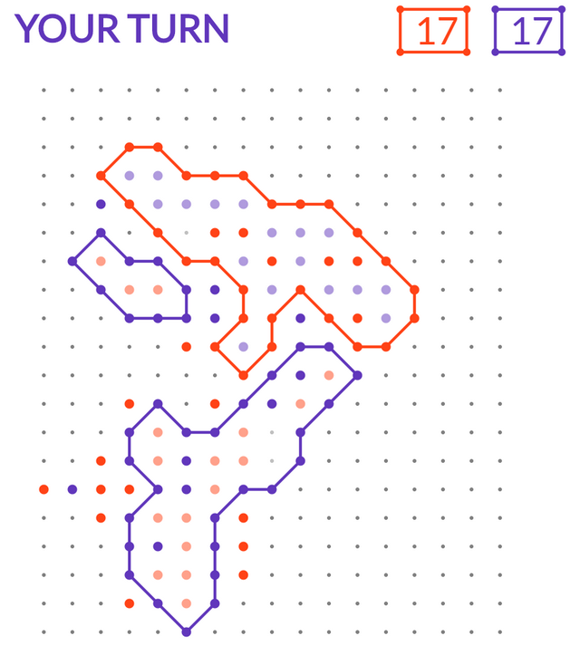

# Zots

It's simple: Blue Zots vs Red Zots. Your mind against your enemy's.

## How to play
1. Open the game in your browser.
2. Send the generated link to player #2.
3. Player #2 opens the link and pushes the Play button.

## Rules
1. This is a turn by turn game.
2. You can surround zots that are not yet surrounded and that are not yet walls (surrounding some other zots).
3. To surround an enemy zot you must build a net of your zots around that zot.
4. You can surround as many zots as you can as long as the net is complete.
5. For net to be complete each of your zots that line the border of the net must be one step away from its neighbors. If a zot is further then one step away from the other zots it is not connected and thus cannot complete the net.
6. For example please see the screenshot below.

What I use:
- clojure
- clojurescript
- pedestal
- om.next
- datomic
- aws

Graphical design by: [Kostya C.K.](http://www.altermade.com)
